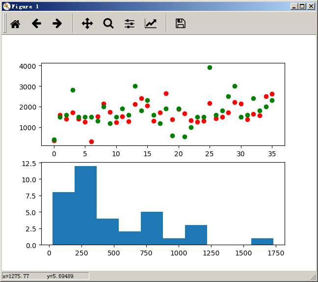

# Price Prediction
author : @wotchin
## 房价预测模型
房价预测模型采用回归预测，包含logistic回归，SVR，KernelRidge三种算法的实现。
使用sklearn来实现算法。自动评估最优参数。
## API接口
1. 接口示例：
> http://127.0.0.1:8080/predict

2. 协议：POST
3. 格式示例：
使用`curl`工具演示为：
```$xslt
curl -d "areas=0&square=100&direction=0" http://127.0.0.1:8080/predict
```
返回JSON格式数据：
```$xslt
{price:1000}
```

## 模型训练
在本目录下输入文件`index.csv`，文件格式如本目录文件所示。
默认使用`SVR`作为回归预测模型，运行`train.py`脚本文件即可。
文件运行结束，标准输出归一化参数，该将参数填到`web.py`文件的起始位置。

## 模型评估
训练结束后，会弹出可视化图表，如下图所示：


上半部分中，红色为预测值，绿色为实际值；
下班部分中，是预测结果的偏差分布，偏差分布越集中在0处越好。